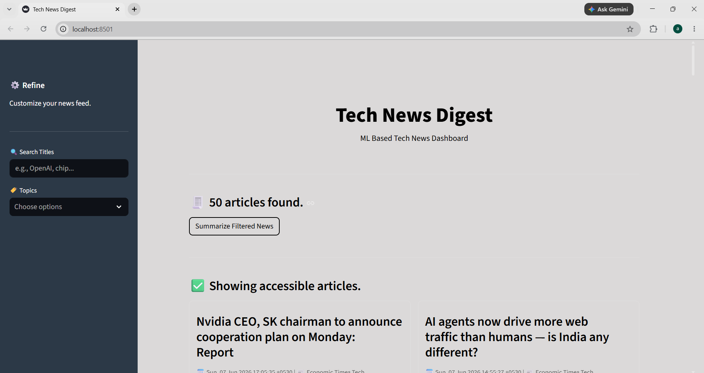
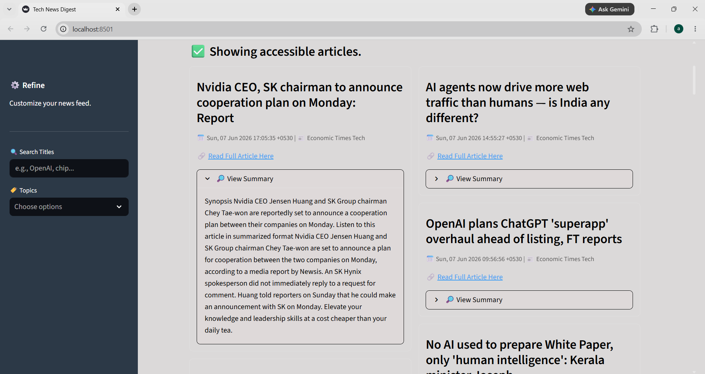
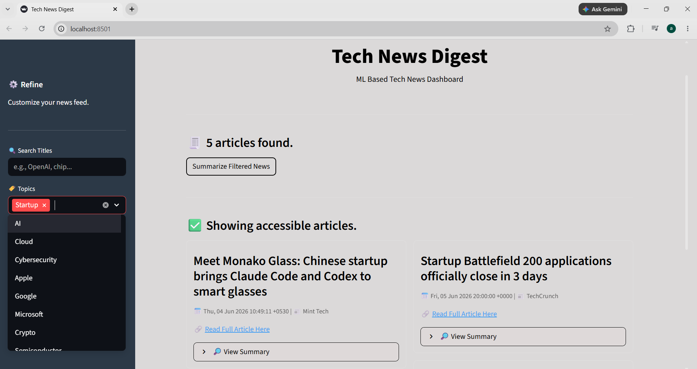

# AI Tech News Summarization Dashboard

An AI-powered technology news aggregation platform that collects the latest news from multiple RSS feeds, filters articles published within the last 24 hours, removes duplicates, and generates concise summaries using NLP.

## Features

- Real-time news aggregation from multiple RSS sources
- Last 24-hour news filtering
- AI-powered abstractive summarization
- Topic-based filtering
- Search functionality
- Interactive Streamlit dashboard

## Tech Stack

- Python
- Streamlit
- Hugging Face Transformers (DistilBART)
- Newspaper3k
- Feedparser
- NLTK

## Screenshots

### Dashboard



### News Summaries



### Topic Filtering



### Full Article Fetching


## Installation

```bash
git clone https://github.com/aishwarya-nagothu/AI-Tech-News-Summarization.git
cd AI-Tech-News-Summarization

pip install -r requirements.txt

streamlit run app.py
```
## Author

Aishwarya Nagothu